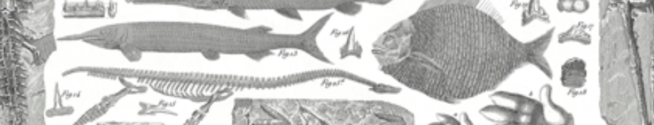

# Dino-Classify
STAT 495 - Consulting

## Table of Contents
- [Project Description](#project-description)
- [Team Updates](#team-updates)

## Project Description
This project involves the use of images collected from a microscope of samples of microvertebrate (<2cm) fossils from the late Cretaceous (~66 million years ago).  These samples are collected from sediment that has been screenwashed to include both rock and fossil material of comparable sizes. The current method for finding these fossils is to manually sit at a microscope and sort rock from fossil. This project will utilize images that were captured and then labeled to identify real fossils identified by the lab to use for ML training.

1.	Perform image analysis on unlabeled image to understand what is detectable on the images and if anything is picked up
  
2.	Train a model using the labeled information to potentially detect a rock versus fossil

#### Deliverables
- Description of initial image processing and potential recommendations gained from the analysis
- Written description (presentation, document, etc) to give to client on analysis performed and insights
- Model training on labeled images
- Recommendations for proper image labeling and future protocols for image labeling
- Model accuracy and validation
- Description of next steps for modeling and future collections

### Team Updates

#### Week 1: Intro Meeting

_Tasks_ : 
- Send client gmails for photo access
- Research image classifier packages
- Test out sample images
- Setup github
